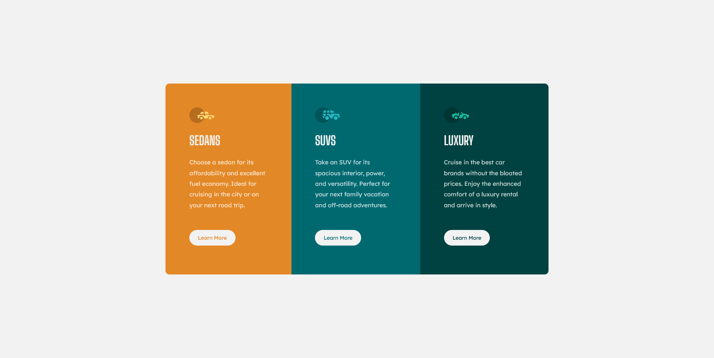
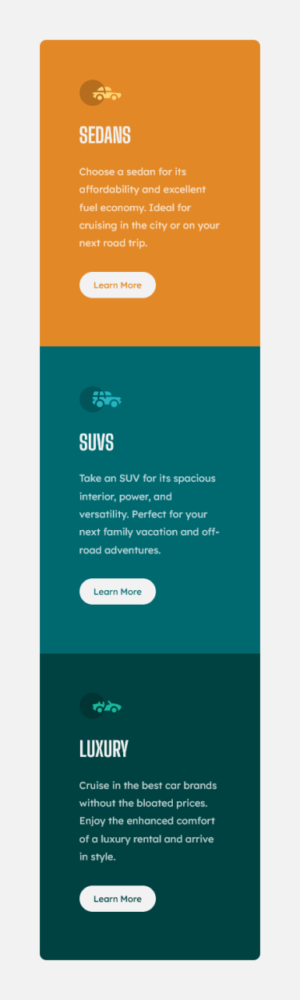

# Frontend Mentor 3-column preview card component solution

This is a solution to the [3-column preview card component challenge on Frontend Mentor](https://www.frontendmentor.io/challenges/3column-preview-card-component-pH92eAR2-). Frontend Mentor challenges help you improve your coding skills by building realistic projects. 

## Table of contents

- [Overview](#overview)
  - [The challenge](#the-challenge)
  - [Screenshot](#screenshot)
  - [Links](#links)
- [My process](#my-process)
  - [Built with](#built-with)
  - [What I learned](#what-i-learned)
  - [Continued development](#continued-development)
  - [Useful resources](#useful-resources)
- [Author](#author)

## Overview

### The challenge

Users should be able to:

- View the optimal layout depending on their device's screen size
- See hover states for interactive elements

### Screenshot

#### Desktop

#### Mobile

### Links

- Solution URL: [https://www.frontendmentor.io/solutions/html5-scss-flexbox-xv80RwiP0]
- Live Site URL: [https://fe-mentor-3-column-preview-card-component.vercel.app/]

## My process

### Built with

- HTML5
- Custom SCSS
- SASS Partials
- Flexbox
- Mobile First workflow

### What I learned

- SASS Variables
- SASS Partials

### Continued development
Continue to focus on mobile first approach. 

### Useful resources

- [SASS Variables](https://sass-lang.com/documentation/variables)

## Author

- Frontend Mentor - [@webdevdjm](https://www.frontendmentor.io/profile/webdevdjm)
- Twitter - [@webdev_djm](https://twitter.com/webdev_djm)

